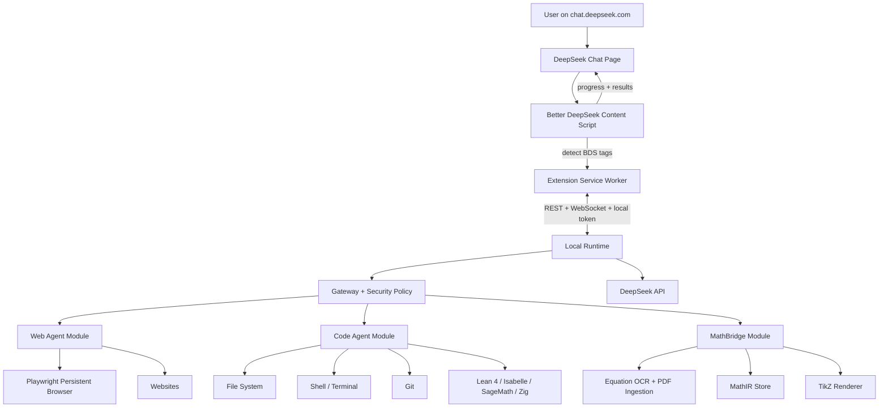

# 00 — Integrated Architecture

## 1. Purpose

Better DeepSeek currently injects tools into `chat.deepseek.com` through a browser
extension. This document extends that model into a full local agent platform with
three modules: Web Agent, Code Agent, and MathBridge.

The user experience stays inside `chat.deepseek.com`. DeepSeek emits tags, the
extension detects them, and a local runtime does the heavy work.

## 2. Core Principle

> The extension is the interface. The local runtime is the brain and hands.
> All real work runs locally by default.

## 3. High-Level Diagram

## 4. New BDS Tags

| Tag ↕▾ | Purpose ↕▾ |
|---|---|
| −`BDS:WEB_AGENT` | Launch autonomous multi-page research |
| −`BDS:CODE_AGENT` | Run a local coding task end-to-end |
| −`BDS:LOCAL_EXEC` | Run one code snippet natively |
| −`BDS:MATH_ANALYZE` | Analyze selected equation/figure/text |
| −`BDS:MATH_PDF` | Ingest a local PDF into MathIR |
| −`BDS:MATH_ASK` | Ask questions over an ingested document |
| −`BDS:TIKZ_RENDER` | Compile TikZ and show SVG |
| −`BDS:AGENT_LOGIN` | Create a persistent login session manually |
| −`BDS:AGENT_STATUS` | Show live agent status |
| −`BDS:AGENT_CONTROL` | Pause, resume, or cancel a task |
⚙

## 5. Local Runtime Requirements

- Node.js 20+ and TypeScript.
- Playwright for browser automation.
- `better-sqlite3` for local state.
- REST + WebSocket API.
- Local bearer token authentication.
- Binds only to `127.0.0.1`.
- All data local by default.

## 6. Build Order

1. **Stage 1** — Code Agent MVP: native execution bridge for Zig and Lean 4.
2. **Stage 2** — Web Agent MVP: read-only multi-page browsing.
3. **Stage 3** — MathBridge MVP: equation selection to LaTeX.
4. **Stage 4** — Web Agent production: interaction and sessions.
5. **Stage 5** — MathBridge production: PDF ingestion and MathIR.
6. **Stage 6** — MathBridge reasoning over MathIR.
7. **Stage 7** — TikZ rendering and figure understanding.
8. **Stage 8** — Hardening, sandboxing, and full test suite.

## 7. Success Criteria

- All three modules share one local runtime.
- The extension remains a normal DeepSeek chat.
- `BDS:LOCAL_EXEC` runs Zig and Lean safely.
- `BDS:WEB_AGENT` completes a 20-minute research task with citations.
- `BDS:MATH_ANALYZE` converts a selected equation to editable LaTeX.
- `BDS:MATH_PDF` ingests a 100-page paper into MathIR.
- `BDS:MATH_ASK` answers using theorem dependencies.
- All data stays local unless the user explicitly opts into cloud sync.

