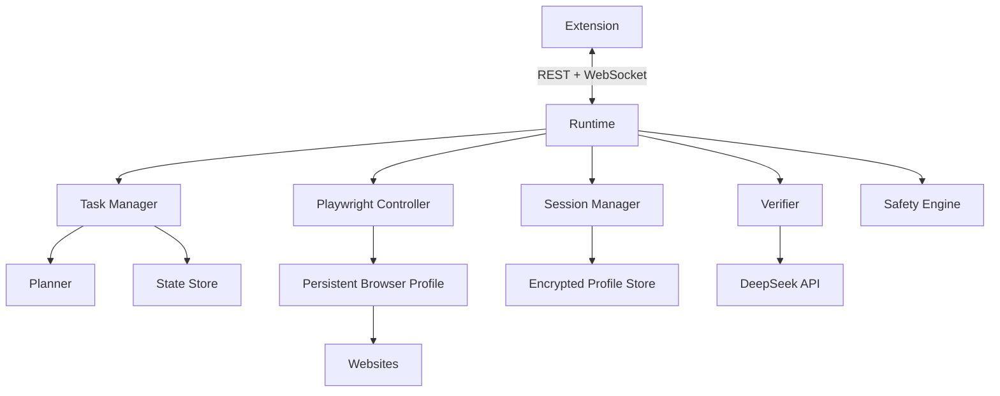

# 02 — Web Agent Production

## 1. Goal

Move the read-only MVP into a full autonomous web agent with interaction, sessions,
verification, and long-running jobs.

## 2. Production Features

| Feature | Description |
|---|---|
| Clicking and scrolling | Automate pagination, expanders, dropdowns |
| Form filling | Fill search boxes with approval |
| Login sessions | Reuse user's manually created sessions |
| Paywall awareness | Mark inaccessible sources and continue |
| Cross-source verification | Compare facts and score confidence |
| Domain allow/block lists | Restrict the agent to trusted domains |
| robots.txt compliance | Respect crawl and indexing rules |
| Background jobs | Tasks continue even if the popup closes |
| Checkpointing | Resume after interruption |
| Full decision trace | Inspect every visited page and action |
| Anti-detection | Rotate fingerprints and use stealth when permitted |
| Rate limiting | Throttle per-domain requests |

## 3. Architecture



## 4. Interaction Levels

| Level ↕▾ | Capability ↕▾ | Default ↕▾ |
|---|---|---|
| −`read-only` | Open pages and extract text | Default |
| −`click` | Click pagination, expanders, links within scope | Opt-in |
| −`fill-forms` | Type into search boxes, submit non-destructive forms | Requires approval |
⚙

## 5. Login and Session Manager

- User starts a visible browser window.
- User logs in manually on the target site.
- The runtime saves the session in an encrypted local profile.
- Later tasks may request that session by name.
- The agent never sees or stores passwords.
- 2FA pauses the task and asks the user.
- The user can revoke sessions at any time.

## 6. Verification Model

| Confidence ↕▾ | Rule ↕▾ |
|---|---|
| −High | Supported by at least two independent sources |
| −Medium | Supported by a single source |
| −Conflict | Sources disagree; report the disagreement |
⚙

Every major claim in the final answer must carry an inline citation.

## 7. Long Background Jobs

- Run on the local runtime, not inside the extension.
- Continue when the extension popup closes.
- Reconnect and show progress.
- Pause and resume.
- Checkpoint after every page.
- One failed page does not fail the whole task.

## 8. Production APIs

```
POST   /tasks
GET    /tasks/:id
GET    /tasks/:id/events
POST   /tasks/:id/pause
POST   /tasks/:id/resume
POST   /tasks/:id/cancel
POST   /approvals/:id
GET    /sessions
DELETE /sessions/:id
GET    /health
WS     /ws
```

## 9. Production Acceptance Criteria

- Visits 10–30 relevant pages autonomously.
- Renders JavaScript-heavy sites in at least 80% of test cases.
- Follows links with meaningful relevance filtering.
- Produces a cited, synthesized answer with confidence levels.
- Pauses safely on CAPTCHA, login, 2FA, or high-risk actions.
- Runs a 20-minute task without crashing.
- Lets the user inspect every page and decision.
- Keeps all data local by default.

